# 🎃 SpookyHaunt - Halloween Event & Fun Website 👻

SpookyHaunt is a thrilling and immersive Halloween-themed website designed to provide users with an eerie and engaging experience. Featuring interactive elements, event listings, and haunted surprises, SpookyHaunt is built using modern web technologies such as Node.js, Express, MongoDB, Handlebars (HBS), and JavaScript. Whether you're looking for spooky events or a haunted adventure, SpookyHaunt delivers an unforgettable experience!

## 🎭 Table of Contents

- [Features](#features)
- [Technologies Used](#technologies-used)
- [Installation](#installation)
- [Usage](#usage)
- [Folder Structure](#folder-structure)
- [Contributing](#contributing)
- [License](#license)

## 🕷️ Features

- **User Authentication:**
  - Sign up, login, logout
  - Forgot password & reset password using Nodemailer
- **Event Listings:**
  - Add, update, and delete spooky events
- **Interactive Haunted House Experience:**
  - Engaging UI with eerie animations
- **Real-time Notifications:**
  - Stay updated on upcoming Halloween events
- **Support Request System:**
  - Users can submit support requests
  - Admins can resolve issues and update status via the admin panel
  - Users receive resolution updates via email
- **Advanced Booking System:**
  - Users can book event slots
  - Booking status updates: "In Progress," "Confirmed," or "Cancelled"
- **Newsletter Subscription:**
  - Users receive spooky updates and exclusive event news via email
- **Comprehensive Admin Dashboard:**
  - Manage users, events, support requests, and bookings
  - Monitor system performance and activities

## 🛠️ Technologies Used

- **Git**: Version control system for project tracking.
- **Node.js**: JavaScript runtime for backend operations.
- **Express**: Fast and flexible Node.js web framework.
- **MongoDB**: NoSQL database for storing user data, events, and bookings.
- **Handlebars (HBS)**: Template engine for dynamic HTML rendering.
- **JavaScript**: Core scripting language for both frontend and backend.
- **HTML/CSS**: Markup and styling for a spooky, immersive design.
- **Nodemailer**: Email service for password resets, booking updates, and newsletters.

## 📥 Installation

1. Clone the repository using Git:
   
   ```bash
   git clone https://github.com/yourusername/spookyhaunt.git
   cd spookyhaunt
   ```
   
2. Install dependencies:
   
   ```bash
   npm install
   ```

3. Create a `.env` file in the root directory and add the following environment variables:
   
   ```bash
   DB_URI=mongodb://localhost:27017/spookyhaunt
   SESSION_SECRET=your_session_secret
   EMAIL_USER=your_email@example.com
   EMAIL_PASS=your_email_password
   ```

4. Start the development server:
   
   ```bash
   npm start
   ```

## 📂 Folder Structure

```bash
  spookyhaunt/ 
  ├── config/                # Configuration files (e.g., database, session, email)
  ├── controllers/           # Handles routes and business logic
  ├── models/                # MongoDB models
  ├── public/                # Static assets (CSS, JS, images)
  ├── routes/                # Express route handlers
  ├── views/                 # Handlebars templates
  ├── .gitignore             # Files to be ignored by Git
  ├── .env                   # Environment variables
  ├── app.js                 # Main application configuration
  ├── package.json           # Project metadata and dependencies
  └── README.md              # Project documentation
```

## 📸 Screenshots

### login page
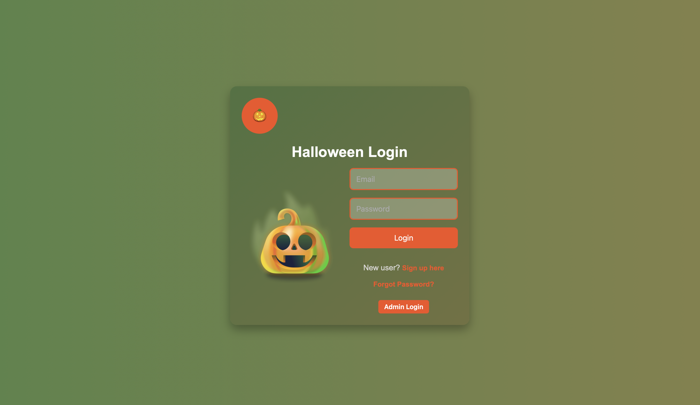

### signup page
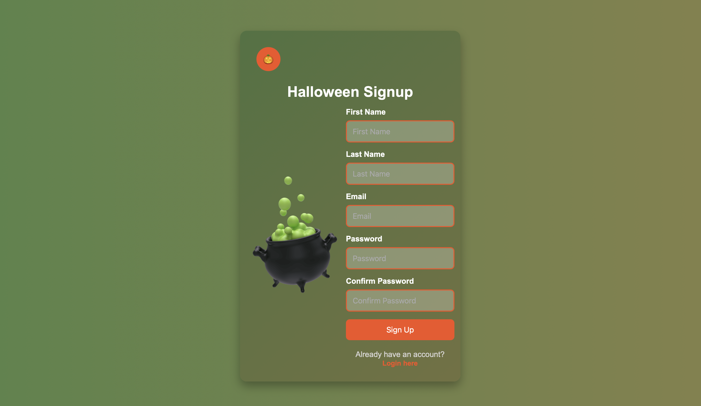

### admin login
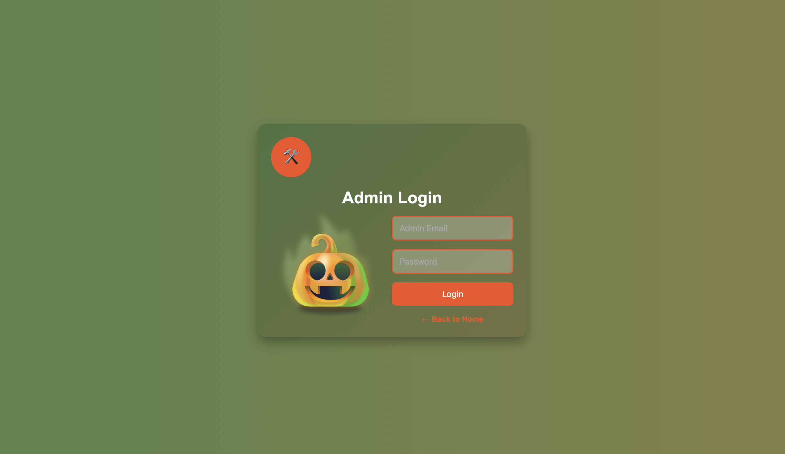

### home page
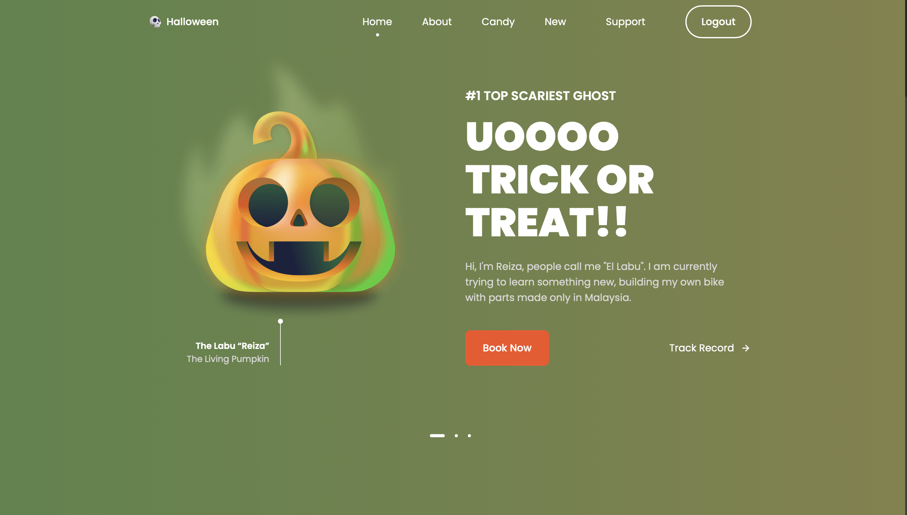

### about section
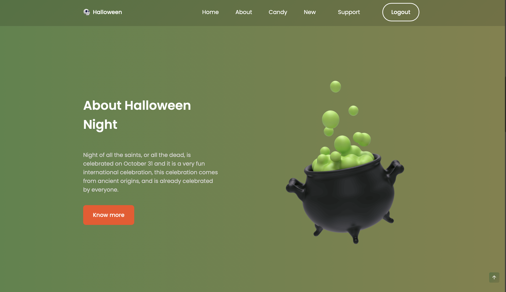

### trick or treat 
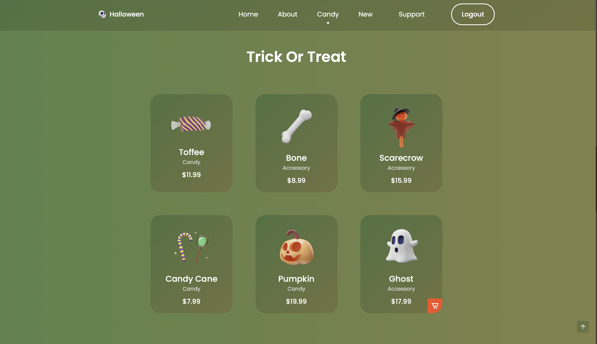

### Ticket booking 
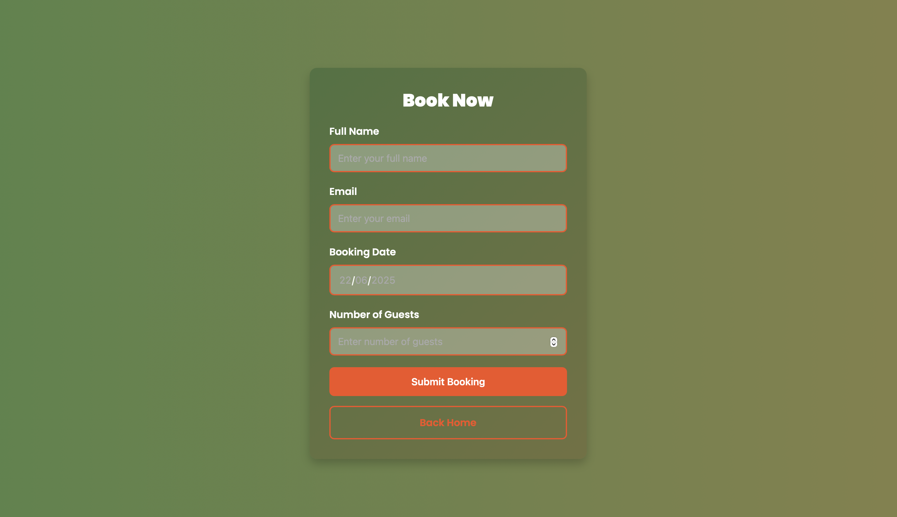

### Ticket booking status
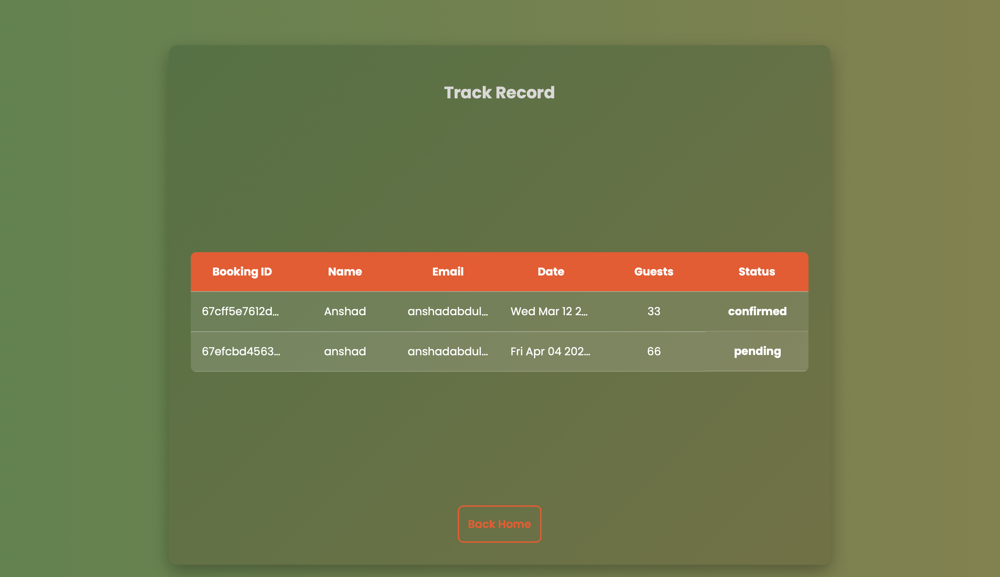

### support request
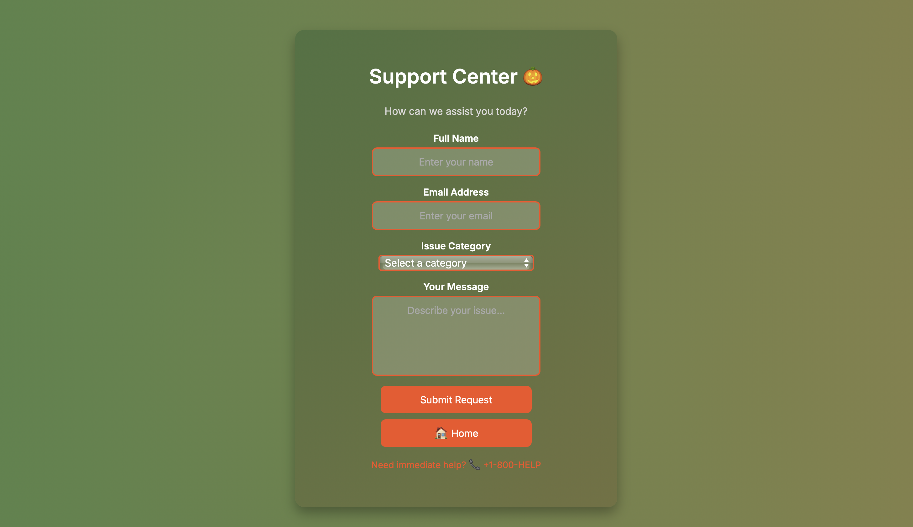

### news letter section
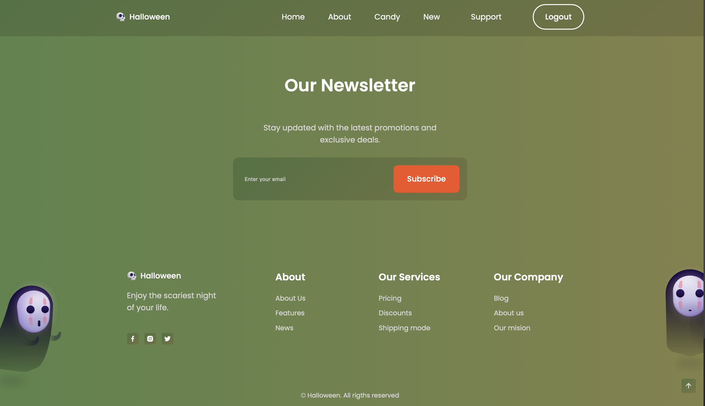

### admin dashboard ticket status update 
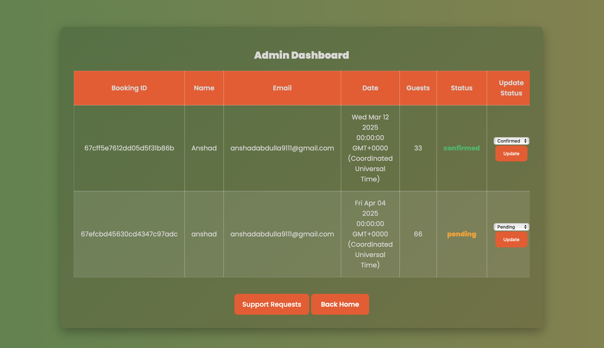

### admin dashboard support request update 
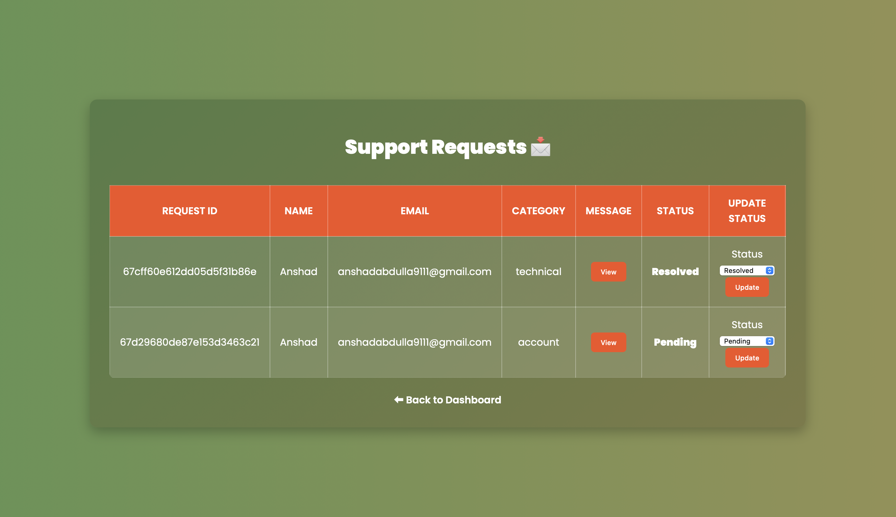


## ⚖️ License

This project is licensed under the MIT License. Enjoy the spooky fun responsibly! 🎃👻

